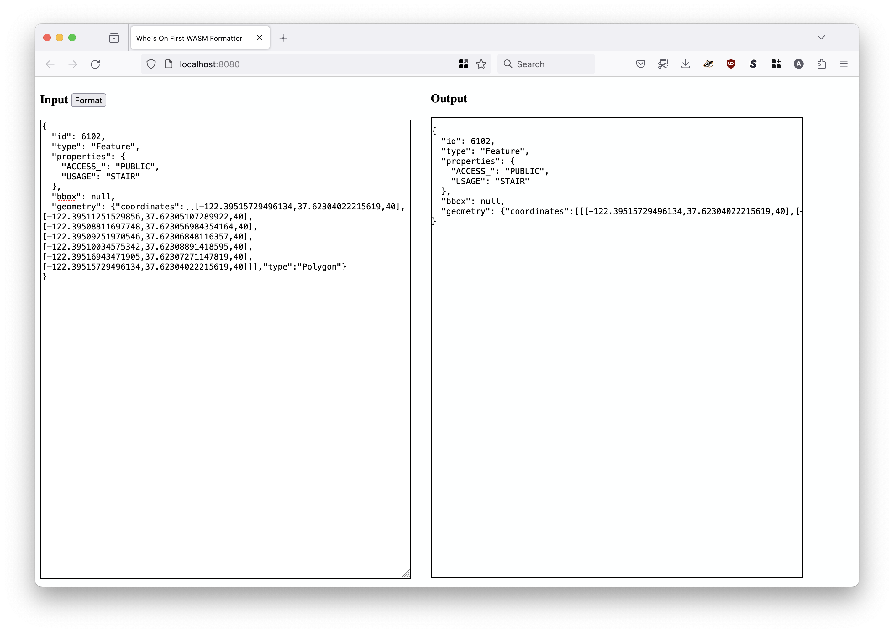

# go-whosonfirst-format-wasm

Go package for building Who's On First formatting tools as WebAssembly (WASM and WASI) binaries.

## Example

### WASI

```
$> make wasip
GOARCH=wasm GOOS=wasip1 \
		go build -mod vendor -ldflags="-s -w" \
		-o static/wasip/wof_format.wasm \
		cmd/wof-format-wasip/main.go
```

And then:

```
$> wasmer static/wasip/wof_format.wasm '{"type":"Feature","properties":{"wof:name":"Test","wof:id": 1, "wof:placetype":"custom", "wof:repo":"whosonfirst-data-example"}, "geometry": {"type":"Point", "coordinates": [0.0, 0.0]}}'
```

Will produce:

```
{
  "id": 0,
  "type": "Feature",
  "properties": {
    "wof:id": 1,
    "wof:name": "Test",
    "wof:placetype": "custom",
    "wof:repo": "whosonfirst-data-example"
  },
  "bbox": null,
  "geometry": {"coordinates":[0,0],"type":"Point"}
}
```

#### WASM (JavaScript)

```
$> make wasm
GOOS=js GOARCH=wasm \
		go build -mod vendor -ldflags="-s -w" \
		-o static/wasm/wof_format.wasm \
		cmd/wof-format-wasm/main.go
```

To test the binary run the [cmd/wof-format-server](cmd/wof-format-server/main.go) tool, like this:

```
$> go run cmd/wof-format-server/main.go
Listening for requests at localhost:8080
```

This will launch a simple two-pane web application where you can enter a document to format on the left and see the result on the right, like this:



## See also

* https://github.com/whosonfirst/go-whosonfirst-format